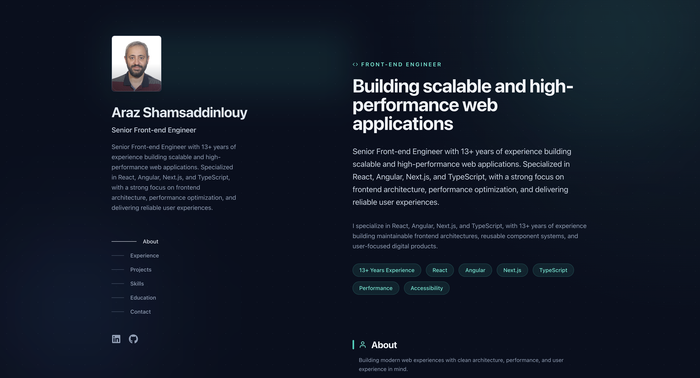

# Personal Portfolio Website

## 📋 Overview

This is my professional portfolio website, built to showcase my experience, skills, and projects as a Senior Front-end Engineer. The site features a clean, modern design with a focus on readability and user experience.

**Live Demo**: [arazshams.vercel.app](https://arazshams.vercel.app)

## 📸 Screenshot

## 🚀 Tech Stack

- **Framework**: [Next.js 14](https://nextjs.org/) (App Router)
- **UI Library**: [React 18](https://reactjs.org/)
- **Styling**: [Tailwind CSS](https://tailwindcss.com/)
- **Deployment**: [Vercel](https://vercel.com/)
- **Font**: [Geist Font](https://vercel.com/font) by Vercel

## ✨ Features

- **Responsive Design**: Fully responsive layout that works on all devices
- **Performance Optimized**: Built with Next.js for optimal performance and SEO
- **Clean Architecture**: Component-based structure with reusable UI components
- **TypeScript**: Type-safe code for better maintainability
- **Modern Styling**: Utility-first CSS with Tailwind for rapid development

## 📁 Project Structure

portfolio/
├── app/ # Next.js App Router
│ ├── (components)/ # Shared components for the app
│ │ ├── About.tsx # About section component
│ │ ├── Contact.tsx # Contact section component
│ │ ├── Experience.tsx # Experience timeline component
│ │ ├── Footer.tsx # Footer component
│ │ ├── Header.tsx # Navigation header component
│ │ ├── Projects.tsx # Projects grid component
│ │ └── Skills.tsx # Skills section component
│ ├── fonts/ # Custom font files
│ ├── layout.tsx # Root layout with metadata
│ └── page.tsx # Main page component
├── public/ # Static assets
│ ├── images/ # Image assets
│ │ └── sc.png # Portfolio screenshot
│ └── favicon.ico # Browser favicon
├── styles/ # Global styles
│ └── globals.css # Global CSS with Tailwind directives
├── types/ # TypeScript type definitions
│ └── index.ts # Shared types and interfaces
├── .gitignore # Git ignore file
├── LICENSE # MIT License
├── next-env.d.ts # Next.js TypeScript reference
├── next.config.js # Next.js configuration
├── package.json # Project dependencies and scripts
├── postcss.config.js # PostCSS configuration for Tailwind
├── README.md # Project documentation
├── tailwind.config.js # Tailwind CSS configuration
└── tsconfig.json # TypeScript configuration
